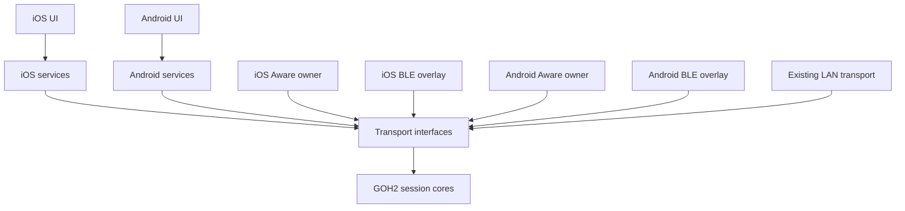
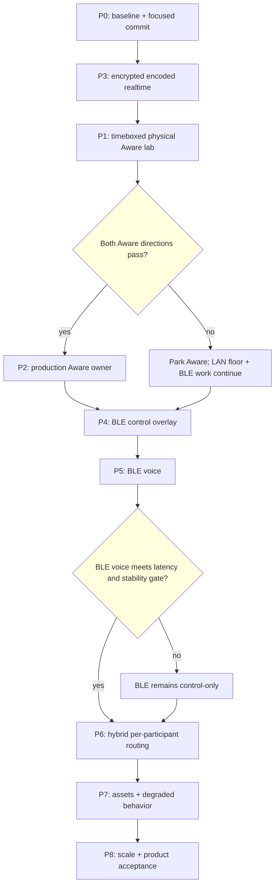

# GetOverHere Execution Plan

**Date:** 2026-08-22
**Status:** Approved with the 2026-08-22 review amendments. P0 remains the first execution checkpoint.

## Intent

Preserve the existing local-LAN product as the guaranteed full-capability floor while pursuing operation without external network hardware. Use native cross-platform Wi-Fi Aware as the preferred direct high-bandwidth route and a bounded bitchat-style BLE relay overlay for universal discovery/control and gated degraded live voice. No-AP audio is a capability-dependent mode, not a universal product guarantee.

The tour product remains one guide to many guests with synchronized audio, slides, a shared target pin, and a sightline pointer. Only the target pin may leave a device; participant locations and headings remain local.

## Current evidence

- The local-LAN product path works across the physical iPhone and Pixel, including audio and synchronized visual state.
- The signed iOS Wi-Fi Aware entitlement and Android Aware capability checks pass on the target devices.
- The production floor remains iOS 17, while Wi-Fi Aware requires newer supported hardware and OS versions. Mixed tour groups will therefore depend heavily on BLE when no LAN exists.
- The target Pixel reports a maximum of eight NAN data paths. This is a device-specific limit, but it proves Aware overflow is normal product behavior rather than a theoretical edge case.
- A separate cross-platform AirDrop-like application transferred files successfully on the same device class, which makes native Aware interoperability credible but does not prove this implementation.
- The iOS Aware lab owns the only `NetworkListener` and `NetworkBrowser` that use Wi-Fi Aware. The production Aware lane classes have no application call sites, so the normal iOS app cannot currently establish an Aware session.
- Android-hosted LocalOnlyHotspot/Wi-Fi Direct was unstable in physical use and is removed from the production direction.
- bitchat implements protocol-compatible iOS/Android BLE controlled flooding and 16 kb/s live AAC voice frames. This proves an implementation path exists; it does not prove GetOverHere's group-size, latency, background, or battery requirements.

## Architecture

### Module ownership

| Module | Owns | Planned impact |
|---|---|---|
| Swift `TourSessionCore` | GOH2 wire contract, session state, deterministic CLI | Add transport-neutral realtime frame and relay/dedup fixtures only when required |
| Kotlin `:tour-session-core` | Exact JVM equivalent of the Swift core | Match every Swift wire and state change byte-for-byte |
| iOS app `Core/` | Aware pairing/connection owner, BLE link/relay transport, LAN transport | Complete the missing production Aware bootstrap; add bounded BLE transport behind existing interfaces |
| Android app `core/` | Aware discovery/NDP, BLE link/relay transport, LAN transport | Repair the cross-platform Aware handshake and add the matching BLE transport |
| Platform `Services/` | Audio lifecycle, presentation, assets, guidance, membership | Consume transport interfaces; remain unaware of radio-specific details |
| Platform UI | Tour flow and diagnostic lab | Keep transport diagnostics out of production; expose only join/reconnect/degraded state |
| `scripts/` and platform tests | Cross-language, simulation, build, and device gates | Add topology, stale-audio, route-switch, and physical-test harnesses |

### Dependency direction

Platform frameworks remain in application implementations. The Swift and Kotlin session cores stay platform-neutral and equivalent.

## Selected transport model

| Transport | Product role | Commitment |
|---|---|---|
| Existing local LAN | Audio, control, and assets on every supported OS when a usable LAN exists | Guaranteed full-capability floor; maintained and tested as a first-class route |
| Native Wi-Fi Aware | Preferred direct audio, control, and asset route without an access point | Capability-, interoperability-, and data-path-limit gated |
| BLE controlled relay overlay | Universal discovery, authentication bootstrap, control, membership, and degraded compressed voice | Control is required; voice ships only if P5 passes |

The app may run BLE and IP transports concurrently. Per-participant preference is healthy Aware, then LAN, then BLE. Stable session, participant, stream, and sequence identifiers suppress duplicates and allow a guest to change routes without becoming a second listener.

Aware and BLE voice have independent planning risks of 35% and 45%. A rough compounded model leaves a 15–25% chance that neither no-AP audio route is shippable. In that outcome BLE remains control-only and a local LAN remains required for tour audio. Product claims and UI must state that directly.

The plan does not bridge Apple peer-to-peer Wi-Fi to Android Wi-Fi Direct, elect an Android hotspot host, or depend on a portable router.

## Scope

### In scope

- Cross-platform Aware discovery, pairing, NDP establishment, and an initial application connection.
- iOS production ownership of Aware listeners, browsers, accepted connections, and reconnects.
- Encoded, sequenced, expiring realtime audio suitable for Aware and BLE.
- BLE devices operating as central and peripheral, with bounded forwarding, split horizon, TTL, deduplication, jitter, rate limits, and successor recovery.
- BLE delivery of authoritative control snapshots and degraded live audio.
- Per-participant route selection across Aware, LAN, and BLE without duplicate state or audio.
- End-to-end application payload encryption using per-tour keys and per-packet nonces, independent of link encryption.
- Existing slides, shared-screen state, target pin, pointer, listener count, reconnect, and privacy behavior across the selected route.
- Deterministic CLI topology simulation and focused commits at every passed gate.

### Out of scope

- Android LocalOnlyHotspot or Wi-Fi Direct as a production dependency.
- Bridging incompatible Apple and Android proprietary peer-to-peer Wi-Fi networks.
- General-purpose ad-hoc routing, Internet relay, Nostr, store-and-forward chat, or courier delivery.
- Guest microphone transmission or multiple guides.
- Forwarding participant location or heading data.
- Shipping an unbounded BLE file flood. BLE asset transfer remains experimental and subordinate to live audio.

## Execution phases and gates

### P0 — Baseline and traceability

**Result:** Harness and baseline verifier passed on 2026-08-23. The harness correctly rejected a missing Android device and a locked iPhone before starting capture; a complete two-device capture remains part of the first physical P3 run.

- Commit this planning/ADR/lesson update as one documentation checkpoint after approval.
- Preserve the working LAN path as the rollback baseline.
- Add a reusable physical-test script that captures app events and platform radio logs without inspecting private frameworks or binaries.

**Gate P0:** clean focused commit; existing `scripts/verify_tour_session.sh` remains green.

### P3 — Harden transport-neutral payloads and replace raw PCM/TCP audio

- Define one cross-platform encoded realtime frame with stream ID, sequence, capture timestamp, codec configuration, expiry, nonce, and authentication tag.
- Add route-independent authenticated encryption for realtime, control, and asset payloads; remove every plaintext application payload path from the working LAN product.
- Select the codec through a focused spike: Opus 20 ms is preferred; native AAC-LC 16 kHz/16 kb/s is the proven BLE fallback if Opus interoperability or dependency cost fails the gate.
- Use datagrams where the transport supports them, a bounded jitter buffer, packet-loss concealment, and stale-frame dropping.
- Preserve receiver/headset default output and the background audio lifecycle.

**Gate P3:** exact Swift/Kotlin frame and encryption fixtures pass; the source/wire verifier finds no plaintext application payload path; 30-minute physical LAN audio passes in both guide directions; mouth-to-ear latency, loss, jitter depth, thermal state, and battery delta are recorded; an injected loss burst never creates an unbounded playback backlog.

### P1 — Reproduce and repair the isolated Wi-Fi Aware lab

- Run iPhone publisher → Android subscriber and Android publisher → iPhone subscriber.
- Test with infrastructure Wi-Fi disconnected, connected to the same LAN, and only one device connected to infrastructure Wi-Fi.
- Record the first failing stage: discovery, PIN bootstrapping, pairing persistence, NDP, socket readiness, or UDP exchange.
- Compare only public API usage and observable behavior with the working AirDrop-like application.
- Keep the lab isolated until both directions pass.
- Timebox the lab to four focused physical-debug sessions or two engineering days, whichever comes first. Each session must isolate one failing stage and end with recorded evidence.

**Gate P1:** both directions establish a direct Aware data path and run the deterministic 20 ms probe for 15 minutes with zero malformed frames, measured loss/RTT, and a successful disconnect/reconnect. If the gate has not passed at the stop-loss, record the exact blocker, park Aware until new vendor/OS evidence or a concrete code hypothesis exists, and continue with LAN plus P4/P5.

### P2 — Complete the production Aware connection owner

- Add the missing iOS production listener/browser/pairing owner.
- Reconcile it with Android's existing production Aware session owner.
- Establish one initial authenticated connection, then open realtime, control, and asset lanes from that established Aware relationship.
- Keep iOS 17 support for LAN/BLE; Aware remains runtime-capability gated.

**Gate P2:** iOS guide ↔ Android guest works in both guide directions without a LAN, authenticates all three GOH2 lanes, counts one stable participant, transfers one slide, and restores state after reconnect.

### P4 — BLE control overlay

- Reuse the validated bitchat concepts, not its product or entire codebase: central+peripheral roles, TTL, message deduplication, split horizon, deterministic fan-out, relay jitter, and bounded topology announcements.
- Keep one authoritative guide. Use epochs, leases, and an ordered successor set instead of full Raft.
- Start with a maximum of six direct central links as an experimental policy, not a platform guarantee.
- Forward only authenticated current-session traffic.

**Gate P4:** deterministic Swift/Kotlin simulation passes line, star, overlapping-star, partition, duplicate-flood, relay/successor loss, and reconnect scenarios at 1/5/10/20/50 logical nodes; physical 2/5/10-device discovery and control convergence are then measured foreground and locked.

### P5 — BLE live-voice fallback

- Send encoded live frames at realtime priority through the BLE overlay.
- Never retransmit expired audio, persist it, or allow it behind asset traffic.
- Bound relay depth initially to two hops and drop frames that cannot meet the playback deadline.
- Keep presentation snapshots on the reliable control path.

**Gate P5:** after the initial one-guide/two-direct/one-relayed proof, physical voice gates progress through 5 and 10 mixed iOS/Android devices. One-hop and two-hop mouth-to-ear latency, loss, queue depth, thermal state, battery use, and locked/pocketed behavior are recorded. There is no queue growth or duplicate playback. If this gate fails, BLE remains control-only.

### P6 — Hybrid route selection

- Prefer a healthy authenticated Aware route, then LAN, then BLE.
- Select routes per participant; do not switch an entire tour because one guest lacks Aware.
- Never attempt more Aware peers than current runtime resources permit. On the target Pixel's reported eight-path limit, guest #9 tries authenticated LAN, then BLE voice if P5 passed, then explicit BLE control-only mode with audio unavailable.
- Do not evict an existing Aware guest to admit an overflow guest. A control-only guest is not counted as receiving audio; the guide sees separate connected and audio-ready counts without radio diagnostics.
- Send authoritative snapshots after every route change.
- Deduplicate overlapping delivery by session/stream/sequence before playback or state application.

**Gate P6:** guests with different available transports participate in the same tour; capacity-plus-one overflow and route loss/recovery produce no duplicate participant, audio, slide, pin, or pointer state. A 60-minute physical run keeps Aware, BLE central, BLE peripheral, LAN, audio encode, and active playback/control traffic enabled concurrently on the guide while recording coexistence loss, thermal state, and battery delta.

### P7 — Assets and degraded behavior

- Use Aware/LAN for full slide and map assets.
- Measure low-priority BLE slide transfer only after P5 passes; pause or throttle it whenever audio is active or backpressured.
- When an uncached asset cannot arrive over the current route, show an explicit pending/degraded state while audio and control continue.

**Gate P7:** cached slides always follow control state over BLE; an uncached slide either transfers within the measured bound without harming audio or produces the explicit degraded state. PMTiles remains an Aware/LAN or preloaded asset.

### P8 — Scale and product acceptance

- Mixed-route tour gates: 8, 16, 32, then 50 guests. Direct Aware count never exceeds the guide's runtime resources; test capacity-minus-one, capacity, and capacity-plus-one before larger mixed-route gates.
- BLE physical topology gates: 2, 5, then 10 devices, with larger counts covered first by deterministic simulation.
- Exercise both guide platforms, mixed infrastructure-Wi-Fi states, lock/background, leave/rejoin, session restart, slides, pin, pointer, asset transfer, interference, and churn.
- Name and run the common AP-less field case: mixed iOS 17–current and Android guests, at least half locked and carried in pockets, with unsupported/exhausted Aware peers using BLE.

**Gate P8:** every product requirement has physical evidence in `ExperimentLog.md`; no privacy payload regression; no capacity claim exceeds the largest passing physical gate.

## Execution flow

## Cross-cutting action

**A8 — Traceability applies to every phase.** Before risky work, preserve the last passing state. After each gate: run the relevant verifier, append exact commands/results to `ExperimentLog.md`, update `ADR.md` or `LessonsLearned.md` when the conclusion changes, review the diff, and create one focused commit before starting the next phase. Never bundle two unproven radio changes into one commit.

## Definition of done

- The guaranteed floor is a first-class mixed iOS/Android LAN tour with full audio, control, and assets and no Internet dependency.
- Supported Aware devices can run the full tour without an external access point after P1/P2 pass.
- Guests without a usable Aware path still discover, authenticate, and receive current control state; they receive no-AP live audio only if P5 passes.
- If both Aware and BLE voice gates fail for a participant, the app explicitly requires a usable LAN for audio. No product claim promises AP-less audio to every supported phone.
- Audio, slides, shared map target, pointer, membership, background behavior, and reconnect pass in both guide directions.
- Every payload is authenticated and encrypted end-to-end at the application layer.
- Participant location and heading never enter a transport payload.
- The supported group size equals the largest passing physical gate, not a theoretical number.

## Risks and rollback

| Risk | Estimated likelihood | Early detection | Prevention | Rollback |
|---|---:|---|---|---|
| Android↔iOS Aware pairing/NDP remains unstable | 35% | P1 cannot pass both roles repeatedly | Isolated lab, public APIs only, exact stage logs | Keep production LAN untouched; continue BLE control/voice work independently |
| Continuous BLE voice congests relay links | 45% | Queue depth, loss, or latency grows at one relay | Compressed frames, deadline drops, two-hop cap, no retransmission | BLE returns to control-only |
| Locked/background relay disappears | 40% | P4/P5 locked-device topology partitions | Platform audio lifecycle, successor set, route snapshots | Require direct BLE/Aware audio; relays become opportunistic |
| Aware runtime capacity is exhausted | High in groups above a device's NDP limit | Available path count reaches zero; capacity-plus-one gate | Per-participant admission and explicit overflow policy | LAN, then gated BLE voice, then control-only |
| Concurrent guide radios degrade one another or drain the battery | 35% | P6 coexistence loss, thermal state, or battery delta exceeds the route-specific baseline | Run the complete radio mix together; disable unused routes per participant | Keep LAN floor; reduce concurrent optional radios |
| Concurrent Aware/LAN/BLE duplicates membership or playback | 25% | Duplicate participant IDs or sequence playback in P6 | One route lease per participant plus pre-delivery dedup | Disable automatic switching; require explicit reconnect |
| Radio work outruns traceability again | 20% | Multiple transport changes appear before a passing gate/commit | A8 checkpoint rule and focused commits | Return to the last passing commit and rerun its gate |

Probabilities are planning estimates, not measured field rates. Treating the 35% Aware and 45% BLE-voice estimates as roughly independent gives a 15.75% dual-failure case; shared RF, background, and device factors justify planning for a 15–25% range. In that case the LAN floor remains the only full audio route.

## Recommended execution mode

Gate-by-gate. Commit P0, execute P3 on the working LAN path, then run the timeboxed P1 lab. A P1 failure parks Aware and proceeds to P4/P5; it does not block transport-neutral product improvements or BLE evaluation. Do not start a phase until its incoming gate passes.
