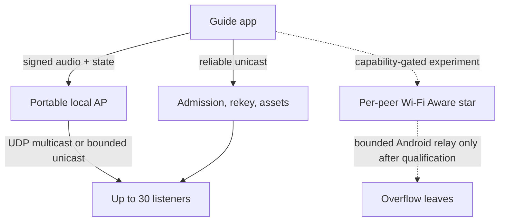

> Archive provenance: user-supplied ChatGPT research report, self-dated 8 September 2026. The report body below is preserved as supplied, including its recommendations, assumptions, and source list. It is research input, not an accepted implementation specification or independently verified test evidence. Read the current synthesis and corrections in [NextSession.md](NextSession.md) before acting on it. The report's date is its author's label, not a new local experiment date.

---

# GetOverHere: Offline Group Audio Architecture Decision

**Research date:** 8 September 2026  
**Decision scope:** one guide, approximately 30 mixed iOS/Android listeners, outdoors, no cloud dependency  
**Evidence basis:** public SDK documentation, standards, platform source, official engineering guidance, and the supplied September 2026 two-Android measurements

## Executive verdict

**D1 - Production architecture:** Preserve the existing LAN transport and make a small, controlled portable access point the supported 30-person mixed-platform mode. The network does not need Internet access. Use application-encrypted UDP multicast for expiring guide audio and compact authoritative state when the selected AP passes qualification; use bounded per-client UDP unicast when multicast is filtered or too lossy. Keep admission, rekey, state repair, and assets on reliable unicast. This is the only currently documented ordinary-app path that can expose a cross-platform IP multicast group. [Apple NWMulticastGroup](https://developer.apple.com/documentation/network/nwmulticastgroup), [Android MulticastLock](https://developer.android.com/reference/android/net/wifi/WifiManager.MulticastLock), [RFC 9119](https://www.rfc-editor.org/info/rfc9119/)

**D2 - Router-free experimental architecture:** Keep BLE discovery/bootstrap and add Wi-Fi Aware as a capability-gated, per-peer star. On Android 12+ one wildcard publisher request can accept multiple peers, but each successful peer still produces a point-to-point network; it is not one group payload. Apple likewise describes listeners, browsers, paired devices, and one or more peer connections. Do not promise 30 until device-specific data-path capacity, mixed-platform pairing, background endurance, latency, and field range pass the gates in this report. [Android Wi-Fi Aware overview](https://developer.android.com/develop/connectivity/wifi/wifi-aware), [Android WifiAwareNetworkSpecifier.Builder](https://developer.android.com/reference/android/net/wifi/aware/WifiAwareNetworkSpecifier.Builder), [Apple WWDC25 Wi-Fi Aware](https://developer.apple.com/videos/play/wwdc2025/228/)

**D3 - Unsupported claim:** There is no documented public API by which an ordinary third-party app transmits one router-free audio packet and 30 arbitrary nearby iOS and Android phones receive it. Wi-Fi Aware 4.0 defines group-addressed security capabilities, but the public mobile SDKs document peer connections rather than a general groupcast transmit primitive. Auracast has the desired RF topology in the Bluetooth specification, but ordinary apps do not have the required cross-platform broadcast-source/sink control APIs. [Android Characteristics](https://developer.android.com/reference/android/net/wifi/aware/Characteristics), [Bluetooth LE Audio FAQs](https://www.bluetooth.com/media/le-audio/le-audio-faqs/), [Android Bluetooth package](https://developer.android.com/reference/android/bluetooth/package-summary)

**Direct answer.** Not today through a single publicly supported, access-point-free broadcast mechanism. GetOverHere may experimentally reach 30 through replicated Wi-Fi Aware unicast or a bounded relay tree, but the current evidence does not establish enough per-device NDP capacity, Apple-Android pairing interoperability, locked-phone relay survival, or 30-device field quality. The supportable route is a no-Internet portable AP plus LAN multicast or bounded unicast; router-free Aware remains a separately gated feature.

## Claim audit

| ID | Status | Finding | Confidence and consequence |
|---|---|---|---|
| F1 | Documented | Android Wi-Fi Aware is available from API 26 on supported hardware; runtime availability and resources vary. | High. Capability-check every device; never infer support from OS version. |
| F2 | Documented | Android API 31 wildcard publisher requests may yield multiple point-to-point links, one Network callback per successful peer. | High. Easier admission does not make one NDP or RF group payload. |
| F3 | Documented | Android exposes maximum and currently available data-path counts; resources are not reserved. | High. The historical eight-path reading is device evidence, not a platform limit. |
| F4 | Documented | Apple Wi-Fi Aware public APIs begin at iOS/iPadOS 26.0 and require a runtime feature check and entitlement. | High. The project’s 26.4 gate is unnecessarily conservative; lower to 26.0 only after testing. |
| F5 | Documented | Apple requires system-mediated pairing for app-to-app/third-party peers; reconnect is described for paired devices nearby while applications are actively running. | High. The current Android static PSK NDP is not the documented Apple pairing contract. |
| F6 | Documented + inferred | Android version 37.2 adds framework-offloaded pairing and runtime bootstrapping-role flags; this is the closest documented counterpart to Apple system pairing. | Medium-high. Intended interoperability is plausible, but physical cross-platform proof is still mandatory. |
| F7 | Contradicted with nuance | “All Apple Wi-Fi Aware requires iOS 26.4.” Base framework/pair/connect APIs begin at iOS 26.0; Apple DTS identifies 26.4 as the boundary for newer additional-connection/port APIs. | High. A 26.4 gate may be justified if the current multi-lane design uses those additions; otherwise capability-gated base support can begin at 26.0. |
| F8 | Unknown | Numeric Wi-Fi Aware error -11992 meaning and the failing operation. | Unknown. Capture the exact call, logs, and sysdiagnose; do not map the code by guesswork. |
| F9 | Measured here | Two Android phones sustained roughly 300 Mb/s one-way on one Aware pair; idle RTT p50 was 15-17 ms and p95 was 155-171 ms. | High for that fixture. It does not establish tiny-packet, 30-peer, locked, mixed-platform, outdoor, or battery behavior. |
| F10 | Inferred | The RTT tail may involve radio duty cycle, TCP ACK behavior, loopback scheduling, coexistence, or host load. | Medium. The distribution is suggestive, not diagnostic; E1 isolates causes. |
| F11 | Documented | Shared-LAN UDP multicast is publicly accessible on both platforms, subject to Apple entitlement/local-network controls and Android multicast filtering controls. | High. It requires a shared Wi-Fi network/AP. |
| F12 | Documented | Wi-Fi multicast has no per-receiver link ACK and can use low rates, suffer movement/power-save loss, or be filtered/converted by APs. | High. Qualify the exact router and retain LAN unicast fallback. |
| F13 | Documented | Android can create a local-only hotspot; Android Wi-Fi Direct can create a group owner. iOS exposes joining supplied Wi-Fi networks, not creating a general app-controlled hotspot. | High for API surface. Mixed 30-client capacity and UI friction are device/AP questions. |
| F14 | Documented + API audit | Auracast supports broadcast in the specification, but Android broadcast source/assistant classes are hidden/system APIs and no equivalent public Apple ordinary-app source/sink control was found. | High for Android; medium for Apple absence. Unsupported for this release. |
| F15 | Documented | Wi-Fi Aware is unavailable when Wi-Fi is disabled on Android. | High. The Wi-Fi-off condition is BLE-only; never market it as Aware. |
| F16 | Documented + measured here | Direct BLE works in the supplied two-Android functional fixture. | High only for fixture behavior. Mixed-platform acoustic, lock, endurance, and group scale remain unknown. |
| F17 | Documented | iOS permits genuine background playback/recording with an active audio session and audio background mode; Android provides playback, microphone, and connected-device foreground-service types. | High for permission model, not an endurance guarantee. |
| F18 | Unknown | Fresh locked-screen Aware discovery and an iOS relay-only process have no documented indefinite execution guarantee. | High consequence. Do not depend on iPhone relays until E4/E6 pass; relay-only background is not justified by playing silence. |
| F19 | Cryptographic limit | An open room can authenticate a session key after selection, but cannot prove the guide’s human identity on first contact without an independent trust anchor or user check. | High. Label the first join “unverified nearby room”; offer spoken/visual SAS or QR/account as optional verification. |
| F20 | Documented + recommended | A reviewed PAKE such as SPAKE2 improves optional-code admission against passive/offline transcript attacks but cannot prevent online guesses or distinguish the guide from every guest who knows the same code. | High. Bind the PAKE transcript to the pinned guide key and rate-limit attempts. |
| F21 | Derived | 20 kb/s Opus at 20 ms with the existing signature and explicit UDP/AEAD assumptions costs about 79.2 kb/s per replicated listener before Wi-Fi link overhead and retry; 30 copies are about 2.38 Mb/s and 1,500 application writes/s. | High arithmetic, medium wire assumptions. Packet/NDP resources can fail before throughput. |
| F22 | Inferred | Multiple logical sockets to one peer normally share its selected Aware Network/NDP; separate lanes do not create radio QoS. | Medium-high. Confirm with counters and interfaces in E2. |

## Operating-condition decision

| Condition | Supported product behavior | Explicit limit |
|---|---|---|
| No Internet; devices share Wi-Fi AP | Primary 30-person mode: LAN discovery/admission, UDP multicast or bounded unicast audio/state, reliable unicast assets. | Router/AP is required; multicast entitlement, client isolation, loss, and 30-client capacity must be qualified. |
| No AP; Wi-Fi and Bluetooth enabled | BLE discovery/bootstrap plus per-peer Wi-Fi Aware where both endpoints support the compatible pairing profile; direct star capped by runtime qualification. | No public cross-platform one-send/30-receive primitive. Overflow is reject/degrade or experimental bounded relay, never unbounded mesh. |
| Wi-Fi actually disabled; Bluetooth enabled | Existing BLE lanes for admission/control/assets and a separately qualified small-group audio fallback. | Aware cannot operate. Do not claim 30 until BLE group acoustic/endurance tests pass. |

## Platform and API matrix

| Mechanism | Exact public API / minimum | Capability and permissions | Pairing / consent | One-to-many data | Locked/background position |
|---|---|---|---|---|---|
| Android Wi-Fi Aware | `WifiAwareManager`, discovery sessions, `WifiAwareNetworkSpecifier.Builder`; API 26+, wildcard publisher Builder API 31+ | `FEATURE_WIFI_AWARE`; runtime `isAvailable`; API 33 nearby-Wi-Fi permission; Wi-Fi/location state; runtime `Characteristics` and `AwareResources` | Open or PSK/PMK NDP; Aware pairing API 34; framework-offloaded pairing in SDK extension/version 37.2 | Public API documents separate peer networks. Group-addressed security support is not a general app groupcast socket. | Use `connectedDevice` FGS; guide also `microphone`, guest also `mediaPlayback`. Microphone FGS must normally start while visible on Android 14+. No latency/endurance guarantee. |
| Apple Wi-Fi Aware | `WiFiAware` + Network framework; base APIs iOS/iPadOS 26.0+; additional connection/port flow documented by Apple DTS for 26.4+ | `com.apple.developer.wifi-aware`, declared `WiFiAwareServices`, runtime `WACapabilities.supportedFeatures`; device support and parallel-path limit vary | DeviceDiscoveryUI for app-to-app/third-party pairing; PIN shown by publisher and entered by subscriber; paired-device selection | Listener may accept multiple peer connections, but docs/sample send to each endpoint; no nearby group datagram. | Genuine background playback/recording can continue with audio background mode. Fresh discovery/reconnect and relay-only survival are not guaranteed. |
| Shared LAN multicast | Apple `NWMulticastGroup`/`NWConnectionGroup` (iOS 14+); Android UDP multicast + `WifiManager.MulticastLock` | Apple multicast entitlement/local-network privacy as applicable; Android `CHANGE_WIFI_MULTICAST_STATE` | LAN join and application admission | Yes at IP API boundary; AP behavior may filter, rate-limit, or convert it. | Audio background/FGS rules above. A stable AP simplifies reconnection but does not override OS lifecycle. |
| Android local-only hotspot | `WifiManager.startLocalOnlyHotspot`, API 26+ | Android guide only; OEM/client-count/power behavior varies | Guests join advertised SSID; iOS may join via system Wi-Fi UI or `NEHotspotConfigurationManager` prompt | Standard IP LAN once joined | Guide battery and hotspot endurance are qualification items; Aware may be unavailable while SoftAP is active. |
| Android Wi-Fi Direct | `WifiP2pManager`, API 14+ | Android group owner; no symmetric iOS Wi-Fi Direct API | Legacy clients may join a GO as Wi-Fi clients, with setup friction | Standard IP LAN after join | OEM stability/client limits; conflicts with Aware possible. Not the primary recommendation. |
| BLE L2CAP | Existing Core Bluetooth L2CAP and Android LE CoC implementation | Bluetooth support/permissions; public peer streams | App admission already implemented | Replicated peer streams or relay only; no arbitrary app broadcast audio | iOS BLE background scans are slower/coalesced; Android sustained work needs `connectedDevice` FGS. Group capacity unknown. |
| LE Audio / Auracast | Platform/system feature, not a complete public ordinary-app source/sink API pair | Compatible LE Audio radios, controller/stack, and typically output ecosystem | System UX/passkey model | Specification supports broadcast | Not usable as GetOverHere packet, asset, and control transport through public cross-platform APIs today. |

**Interop contract to test.** Use one IANA-style exact service string within Apple’s limit, for example `_goh-audio._udp`: the unique component is ASCII letters/numbers/dashes, contains a letter, does not begin/end with a dash, and is no more than 15 characters; the suffix selects TCP or non-TCP semantics. Apple’s published peer profile requires Wi-Fi Aware v4 pairing/security behavior, including NIK caching, NCS-PK-PASN-128 and required group/management protections. On Android 37.2, enable `setFrameworkOffloadedPairingEnabled(true)` on the publish and subscribe configurations, require `isAwarePairingSupported()`, and inspect `getSupportedOffloadBootstrappingMethods()`. The Android guide/publisher needs PIN-display capability; an Android guest/subscriber to an Apple guide needs PIN-keypad capability. Allow at least 30 seconds for the first paired data path. Do not send the existing room-code-derived SK-128 as though it were Apple system pairing. Keep application-layer room admission and media encryption above link pairing.

Apple describes Wi-Fi Aware as cross-platform and DeviceDiscoveryUI as able to pair with third-party devices. That is a supported direction, not proof that the project’s current Android security setup interoperates. Android 37.2 framework-offloaded pairing is the candidate change; E3 must prove both role orientations on shipping devices. In a first-time mixed-platform router-free room, Apple’s public flow necessarily adds device selection and a six-digit system pairing ceremony per guest. “Open room” can still mean no GetOverHere room code, but cannot mean zero user verification on first contact; already paired guests can reconnect without repeating the ceremony. The observed AirDrop-style share-sheet transfer is consistent with privileged Quick Share/AirDrop integration, but share-sheet interoperability is not a reusable socket or radio transport API for GetOverHere.

## Recommended architecture

### Primary LAN path

1. The guide creates a room and the app advertises it on the local LAN. BLE can remain a low-energy discovery assist, but discovery metadata never grants admission.
2. Admission creates pairwise secure channels and returns the authoritative signed room descriptor, guide signing key fingerprint, session ID, current media epoch, transport parameters, and state manifest.
3. Audio is 20 ms Opus in expiring UDP datagrams. For a qualified AP, the guide encrypts/signs once and multicasts the immutable datagram. Receivers verify the pinned guide signature and group epoch. If multicast is unavailable or fails its loss gate, the guide sends the same immutable datagram on bounded UDP unicast connections.
4. Current presentation pointer/slide/map target is compact authoritative state with sequence and expiry. Send current state promptly; periodic snapshots repair loss.
5. Slides and offline maps are content-addressed chunks over reliable unicast with hashes, range/bitmap resume, receiver feedback, and a low-priority token bucket. Prefetch the tour package before the walk whenever possible.
6. No participant location or heading leaves the phone. A guide-selected target is signed application state.

### Router-free Aware path

The guide remains the authoritative root. Each admitted peer consumes a separately observed Aware connection/network even when a wildcard request simplifies listener code. Query maximum and available resources before admission, then apply a product cap learned from E5. Reject or offer LAN/BLE fallback when capacity is exhausted; never continue retrying invisible resource failures.

For overflow research only, use a depth-two tree such as five guide-connected relays with up to five children each. A relay has one upstream plus at most five downstream connections; it forwards the original bytes and never re-signs or admits. This reduces guide fan-out to five but does not reduce total edge transmissions. Prefer Android relays because a `connectedDevice` foreground service gives a clearer execution model; iPhone relay-only background operation is unsupported until proven. If a relay disappears, children use a guide-signed alternate relay ticket or return to admission. A 30-person tour must not depend on a best-effort relay tree before lock/endurance/failover gates pass.

### Explicit unsupported cases

- One public Wi-Fi Aware groupcast packet delivered to 30 mixed phones without per-peer setup.
- Wi-Fi Aware while the Wi-Fi radio is disabled.
- Auracast as an ordinary-app arbitrary media/assets/control transport.
- Silent audio or generic background tasks used to keep an iOS relay alive.
- Treating the numeric Apple error, share-sheet transfer, two-phone throughput, or decoded tone as proof of 30-person field operation.

## Security architecture

**D4 - Guide authority.** Create an ephemeral P-256 guide signing key per room unless a separately anchored long-term identity exists. The room descriptor signs `{protocolVersion, roomName, sessionID, guideKey, fingerprint, epoch, capabilities, expiry}`. At selection the guest pins `(sessionID, guideKey)` and requires a signed nonce response. Every authoritative guide frame is signed over immutable authenticated fields and ciphertext. A guest possessing the media group key can decrypt but cannot forge guide state.

For an open room, present the first nearby key as unverified. Optional verification can be a spoken/displayed short authentication string, QR code, account/certificate, or an organization-managed key. TOFU detects later key replacement inside the selected session but cannot defeat a first-contact evil twin with the same room name.

**D5 - Optional room code.** Replace raw code-to-session-key derivation with a reviewed SPAKE2 profile and test vectors. Bind the transcript to the room/session ID, guide public key, roles, protocol/cipher version, and endpoint identities; require explicit key confirmation. The short code gates admission but remains vulnerable to online guesses, so apply per-source and global throttles, exponential delay, attempt budgets, and constant-shape errors. If all guests know one code, PAKE proves code knowledge, not guide identity; the pinned signing key remains necessary. [RFC 9382](https://www.rfc-editor.org/info/rfc9382/)

**D6 - Immutable origin frames.** A signed audio/control envelope covers `{version, sessionID, guideKeyID, epoch, lane, sequence, captureTimestamp, expiry, ciphertext, AEAD tag}`. The guide signs and encrypts once; relays copy byte-for-byte. Use a fresh random epoch key and deterministic unique nonces per `(epoch, lane, origin, sequence)`; sequence never resets under one key. Receivers authenticate, enforce expiry, maintain a sliding replay window, and suppress duplicates. Never re-encrypt the same content on another route under the same key/nonce. [NIST SP 800-38D](https://csrc.nist.gov/pubs/sp/800/38/d/final), [RFC 3711](https://www.rfc-editor.org/info/rfc3711/)

**D7 - Relay authority and rekey.** A relay needs a guide-signed, expiring lease containing its member ID, parent, epoch, maximum children/rate, and expiry. It cannot issue admissions or keys. Rate-limit before expensive PAKE/signature work, cap per-child queues, drop stale audio, and treat relay drop/delay as an availability risk that cryptography cannot prevent. To remove a member, increment the media epoch, create new keys, and wrap them only to retained members over pairwise channels; changing the displayed code alone does not revoke prior members. For this one-authoritative-sender group, O(n) rewrap is simpler than MLS; adopt MLS only if future multi-sender and forward/post-compromise-security needs justify it. [RFC 9420](https://www.rfc-editor.org/rfc/rfc9420.html)

## Capacity and timing model

### Peers, data paths, interfaces, and sockets

An Aware peer is a discovered remote device. An NDP is a point-to-point NAN data path to a peer. An Aware data interface may host one or more NDPs, depending on implementation; it is not equal to a guest. A `Network` is the OS routing object reported to the app for a successful connection. Multiple TCP/UDP sockets bound to the same peer `Network` normally share that path; they add application lanes, not independent radio reservations. The wildcard Android publisher Builder can create multiple peer connections from one `NetworkRequest`, but each success still has a separate `Network` callback and consumes implementation resources. Query `Characteristics.getNumberOfSupportedDataPaths()` and `getNumberOfSupportedDataInterfaces()`, then observe `AwareResources.getAvailableDataPathsCount()` before and after each peer. Resource numbers are ceilings/availability signals, not reserved capacity or performance promises.

### Wire arithmetic

Assume IPv6 (40 B) + UDP (8 B) + existing wrapper header (8 B) + P-256 signature (64 B) + AEAD tag (16 B) + explicit nonce (12 B) = **148 B fixed per application datagram**, excluding Wi-Fi MAC/security/ACK/retry, FEC, admission, and any unspecified stream metadata.

| Codec packet | Payload | Rate | Bytes/datagram | Per listener | 30 replicated listeners |
|---|---:|---:|---:|---:|---:|
| Opus, 20 kb/s, 20 ms | 50 B | 50/s | 198 B | 79.2 kb/s | 2.376 Mb/s; 1,500 writes/s |
| AAC-LC, 16 kb/s, 64 ms | 128 B | 15.625/s | 276 B | 34.5 kb/s | 1.035 Mb/s; ~469 writes/s |
| Opus, two frames batched | 100 B | 25/s | 248 B | 49.6 kb/s | 1.488 Mb/s; 750 writes/s |

TCP adds at least 12 B more transport header per data packet than UDP, plus ACK/retransmission behavior. At 20 ms Opus, the 72-byte signature wrapper alone costs 28.8 kb/s per receiver. Batching two Opus frames saves about 0.888 Mb/s across 30 listeners but adds up to 20 ms packetization delay and doubles each loss burst; test it rather than assuming it wins.

The 300 Mb/s benchmark used one Aware pair, large 65,536-byte blocks, foreground/unlocked phones, and no full codec/AEAD path. It establishes bulk goodput and routing correctness only. A 30-peer design stresses NDP allocation, 1,500 tiny writes/s, airtime fairness, per-peer link ACK/retry, RF margins, socket scheduling, CPU/signatures, thermal and background behavior. Resource exhaustion or tail latency can fail far below the nominal throughput.

For a five-relay/five-leaf tree, guide audio egress is about 396 kb/s; each relay receives 79.2 kb/s and emits about 396 kb/s. Total edge payload remains 2.376 Mb/s and adds a second scheduling/jitter hop. The benefit is guide NDP/fan-out relief, not free airtime.

### Realtime behavior

Promote UDP for expiring audio after E1. Use sequence, capture timestamp, playout deadline, codec ID, epoch, and route ID; a small reorder window; duplicate/late drop; Opus PLC for isolated loss; and measured-loss-triggered in-band FEC. Pace per-peer copies across the 20 ms frame interval rather than emitting a 30-packet burst. Send receiver reports at 1-2 Hz for loss, late loss, jitter, buffer occupancy, and RTT. Apply congestion response per peer. Keep TCP with `TCP_NODELAY`, small send buffers, bounded queues, and write-deadline instrumentation as fallback.

Start the playout buffer at 40-80 ms and adapt up to 120 ms, with 150 ms a hard product cap. Use source timestamps plus NTP-like four-timestamp probes for clock offset; wall clocks alone cannot measure one-way delay. Acoustic measurement needs a known click/MLS source and simultaneous external capture of the guide input and listener outputs.

**Proposed engineering gates, not platform guarantees:** network one-way p95 <=50 ms and p99 <=100 ms, with no sustained value above 150 ms; acoustic mouth-to-ear p50 <=120 ms, p95 <=180 ms, p99 <=250 ms, and no burst above 400 ms; playback skew p95 <=20 ms on speakers and <=40 ms with headphones; expired/lost audio <=1% per listener per minute; no concealment burst above 200 ms more than once per 10 minutes. ITU G.114’s 400 ms planning limit is conversational guidance, not a tour-specific SLA; validate thresholds with listening tests. [ITU-T G.114](https://www.itu.int/rec/T-REC-G.114), [RFC 8085](https://www.rfc-editor.org/info/rfc8085/), [RFC 7587](https://www.rfc-editor.org/info/rfc7587/)

### Asset scheduling and state recovery

One scheduler owns all lanes because different sockets still share one radio. Priority is: unexpired audio; current authoritative control/state; current/next slide; map/history. Assets use a token bucket capped from group-qualified safe throughput, initially one or two large transfers per source/relay. A 1 MiB slide copied directly to 30 guests is 30 MiB guide egress; even a 10 Mb/s aggregate payload budget needs at least 25.2 seconds before overhead.

Content-address assets with a signed manifest, chunk hashes, sparse/range resume, and receiver ACK/NACK bitmaps. Relays may cache only verified chunks. A late joiner receives the small current state snapshot and manifest first, then the current target/slide, then the next slide, then bulk/history. On LAN, keep reliable repair unicast even when the initial audio/state or asset pass is multicast.

## Prioritized executable experiments

| ID | Hypothesis and setup | Instrumentation | Pass/fail and decision unlocked |
|---|---|---|---|
| E1 | **Two Android latency isolation.** Randomized 30-minute runs, three repetitions: direct Aware UDP echo, TCP, TCP with `TCP_NODELAY`, and current loopback adapter; 1 vs 4 lanes; idle vs paced/saturated assets; AP associated/unassociated; Bluetooth on/off; idle/CPU/thermal load. | 50 packets/s (~90k/run); timestamps at capture/encode/enqueue/syscall/receive/decrypt/decode/playout; RTT CDF p50-p99.9, burst loss, autocorrelation, retransmit/cwnd where available, radio/thermal state. | Promote UDP if no-bulk p99 <=100 ms and <=1% late/lost while TCP misses. If all paths retain periodic tails, focus on radio/power rather than more socket patches. |
| E2 | **Two Android resource mapping.** One peer, multiple sockets/lanes, then as many physical peer devices as available. Record resources before/after every NDP and interface. | `Characteristics`, `AwareResources`, Network callbacks, interface/routing tables, socket-to-Network IDs, failure reasons. | Confirm sockets to one peer do not consume additional NDPs. Define a conservative per-model admission cap; stop direct-star work on a guide model below required peers. |
| E3 | **One iPhone + one Android interoperability, both role orientations.** iOS 26.x supported device and Android 37.2 device; exact `_goh-audio._udp` name; Android framework-offloaded pairing; fresh pair/unpair and reconnect; >=30 s timeout. | Screen recording, paired-device records, bootstrapping flags, Network IDs/routes, packets, Android bugreport and Apple sysdiagnose on failure; log the precise operation returning -11992. | At least 50 fresh pair attempts/orientation >=95% and 100 reconnects >=99%, no LAN route. Failure due to missing role capability or repeatable official-flow incompatibility blocks mixed Aware release. |
| E4 | **Acoustic and lock qualification for one mixed pair.** Guide/guest in both platform orientations, 60-90 min; screen lock while active; app switch; incoming call/alarm/assistant; headset removal; low-power modes; Wi-Fi/AP/Bluetooth changes. | External multichannel recorder, click/MLS cross-correlation, audio-route/interruption logs, process lifecycle, battery and thermals, Aware performance report on Apple. | Meet timing gates; no unexplained disconnect; reconnect p95 <=3 s after <10 s outage and <=8 s after 10-60 s. Otherwise restrict to screen-on or LAN; a failed relay-only iOS case forbids iPhone relay. |
| E5 | **Scale the direct star.** 1 guide + 4, 8, 12, 16, 24, 30 listeners across shipping target models, Android first then mixed after E3; 90-minute outdoor walk, randomized locks, weak-edge users, controlled RF load and paced assets. | Per-device admission/NDP/resource count, loss/late/jitter/skew, CPU/battery/thermal, reconnects, route verification and guide send-loop time. | Every supported model/role meets QoS and endurance at the advertised cap. Stop at first stable resource/QoS knee; do not extrapolate across it. |
| E6 | **Bounded relay tree.** One guide, two then five relays, four/eight then up to 30 total; relay lock, movement, deliberate relay removal, duplicate routes, asset load. | Signed-frame byte identity, leases, topology, hop timestamps, queue depth, subtree loss/failover and battery. | No authority escalation, failover audio gap <=500 ms, QoS gates pass. If locked relays suspend or subtree loss is excessive, remove relay from production scope. |
| E7 | **LAN reference at 30.** Exact portable router candidates; multicast vs bounded UDP unicast; AP multicast conversion/isolation settings; 90-minute outdoor walk and asset bursts. | AP counters, per-receiver loss/jitter/skew, guide CPU/battery, multicast entitlement and route checks, reconnect time. | Choose one qualified router/configuration. If multicast fails, ship LAN unicast when it passes; if neither passes, the 30-person promise is blocked. |
| E8 | **Wi-Fi-off BLE fallback.** Mixed phones at 2, 4, 8 and upward only while gates pass; 60-minute walk, locks, relay loss. | Connection count, throughput, acoustic latency/dropouts, scan/reconnect, battery and background lifecycle. | Publish the proven cap and feature subset. Failure at small scale limits BLE to discovery/control, not live group audio. |
| E9 | **Adversarial protocol tests.** Evil-twin room, admitted-guest forgery, replay/duplicate/expired frame, old epoch, online code guesses, malicious relay, flood before PAKE. | Cross-language byte tests, property/fuzz tests, counters and rate limits, packet captures without keys. | Only pinned guide frames control state; old/replayed frames rejected; no nonce reuse; revocation blocks new epoch; work amplification bounded. |

No single test round eliminates chipset dependence. Maintain a qualification matrix by OS release, device family, role, lock state, RF condition, and transport.

## Implementation sequence

### Coding work

1. Add transport provenance and observability: Network/NDP IDs, interface/routes, lifecycle, per-stage timestamps, queue age, retransmits, resource counters, loss/late/jitter/thermal/battery, and exportable run manifests.
2. Keep LAN baseline intact. Introduce a platform-neutral expiring UDP realtime lane with the existing protocol core, sequence/timestamp/expiry, per-peer pacing, small buffers, PLC/FEC hooks, and TCP fallback. Remove loopback from the experiment path without deleting the known-good adapter.
3. Integrate guide-key delivery, signed nonce confirmation, session pinning, and verification on every production guide lane. Make relays forward the identical signed ciphertext.
4. Add epoch/key distribution, replay windows, deterministic nonce allocation with crash-safe epoch changes, signed relay leases, member removal, and rekey. Add SPAKE2 for optional codes using a reviewed library/profile.
5. Implement Android version-37.2 framework-offloaded pairing behind runtime checks; retain current Android-Android PSK only as a distinct compatibility profile. Align service names and `_udp` transport with Apple declarations. Split Apple availability: base Aware pair/connect can be capability-gated at iOS 26.0, while the extra connection/port mechanism stays gated at 26.4 if used by the multi-lane design. Preserve the iOS 17 baseline for LAN/BLE.
6. Add one shared lane scheduler, content-addressed assets, resumable chunks, authoritative snapshots, and late-join prioritization.
7. Add explicit admission caps and user-facing fallbacks: portable-router LAN, qualified Aware cap, BLE degraded mode, and clear Wi-Fi-radio-off messaging.

### Physical qualification work

Run E1-E2 before changing architecture based on latency guesses; E3 before any mixed-Aware claim; E4 before locked-phone claims; E5 only after one pair is stable; E6 only after the direct-star cap is known; E7 in parallel as the release reference; E8 as a separately capped fallback; E9 before security sign-off. Store raw observations and a signed build/device/config manifest for every run. Simulators, codec fixtures, and bulk synthetic benchmarks remain component tests, not field qualification.

## Stop conditions and risks

| ID | Risk / stop condition | Required response |
|---|---|---|
| R1 | Target guide reports too few available NDPs or admission fails at the business cap. | Stop claiming a 30-peer Aware star; use the qualified cap and LAN. |
| R2 | Official Android offloaded pairing cannot repeatedly pair/reconnect with Apple in both orientations. | Stop mixed Aware release; preserve platform-local Aware only if useful. Do not reverse-engineer private pairing. |
| R3 | iOS relay-only or locked relay execution suspends, or bounded-tree failover exceeds 500 ms. | Remove iPhone relays; if Android relays also fail, remove relay overflow entirely. |
| R4 | UDP does not improve tails and Apple realtime mode only trades unacceptable battery for latency. | Keep measured best transport, adjust supported topology/buffer, or require LAN; do not disguise radio tails with stale buffering. |
| R5 | Thirty-device 90-minute field runs miss timing, loss, reconnect, thermal, or battery gates. | Do not launch a 30-person router-free promise. Publish the lower proven cap or require the qualified AP. |
| R6 | Exact AP filters/isolates multicast or loss is excessive. | Switch to bounded LAN unicast or another qualified AP; reliable asset repair remains unicast. |
| R7 | BLE group audio fails early under Wi-Fi-off mixed-phone tests. | Limit BLE to discovery/control/assets or the measured small cap. |
| R8 | Public Auracast source/sink APIs remain absent on either platform. | Exclude Auracast from product plans regardless of device marketing support. |
| R9 | First-contact guide identity is presented as verified without SAS/QR/account/PKI. | Correct UX/security claim; open-room TOFU is session continuity, not human identity. |

## Remaining architecture-changing questions

1. What `maximumConnectableDevices` does each target iPhone report, and what Android max/available data paths and offload bootstrapping roles do target Android models report?
2. Does Android 37.2 framework-offloaded pairing interoperate with Apple DeviceDiscoveryUI in both publisher/subscriber orientations, including first pair and reconnect?
3. Does the exact app call that returns -11992 fail before pairing, endpoint creation, listener/browser run, or connection establishment?
4. What is the minimum supported device/OS fleet and acceptable user setup? Accepting a small preconfigured AP changes the answer from experimental to supportable.
5. What advertised group cap and battery budget are commercially acceptable if E5 finds a stable knee below 30?
6. Is optional human guide verification required, and if so is spoken/displayed SAS sufficient or must organizational identity persist across tours?

## Sources

Accessed 8 September 2026 unless a publication date is shown.

1. Android Developers, [Wi-Fi Aware overview](https://developer.android.com/develop/connectivity/wifi/wifi-aware), updated 14 Aug 2026.
2. Android SDK, [WifiAwareNetworkSpecifier.Builder](https://developer.android.com/reference/android/net/wifi/aware/WifiAwareNetworkSpecifier.Builder), updated 3 Aug 2026.
3. Android SDK, [Characteristics](https://developer.android.com/reference/android/net/wifi/aware/Characteristics) and [AwareResources](https://developer.android.com/reference/android/net/wifi/aware/AwareResources), current 2026 references.
4. Android SDK, [PublishConfig.Builder](https://developer.android.com/reference/android/net/wifi/aware/PublishConfig.Builder) and [SubscribeConfig.Builder](https://developer.android.com/reference/android/net/wifi/aware/SubscribeConfig.Builder), including version 37.2 framework-offloaded pairing.
5. Android Open Source Project, [Wi-Fi Aware](https://source.android.com/docs/core/connect/wifi-aware), updated 22 Jul 2026.
6. Apple Developer, [Wi-Fi Aware framework](https://developer.apple.com/documentation/wifiaware) and [supportedFeatures](https://developer.apple.com/documentation/wifiaware/wacapabilities/supportedfeatures), iOS/iPadOS 26.0+.
7. Apple, [Supercharge device connectivity with Wi-Fi Aware](https://developer.apple.com/videos/play/wwdc2025/228/), WWDC25.
8. Apple, [Wi-Fi Aware entitlement](https://developer.apple.com/documentation/bundleresources/entitlements/com.apple.developer.wifi-aware) and [WiFiAwareServices](https://developer.apple.com/documentation/bundleresources/information-property-list/wifiawareservices).
9. Apple Developer, [Building peer-to-peer apps](https://developer.apple.com/documentation/wifiaware/building-peer-to-peer-apps); Apple DTS, [Wi-Fi Aware one-to-many discussion](https://developer.apple.com/forums/thread/795596), Aug 2025, and [additional connections over Wi-Fi Aware](https://developer.apple.com/forums/thread/818708), Mar 2026.
10. Apple, [Accessory Design Guidelines for Apple Devices](https://developer.apple.com/accessories/Accessory-Design-Guidelines.pdf), Wi-Fi Aware chapter, rev. metadata 8 Jun 2026.
11. Apple Network, [NWMulticastGroup](https://developer.apple.com/documentation/network/nwmulticastgroup); Apple DTS, [multicast entitlement guidance](https://developer.apple.com/forums/thread/655920), 2020.
12. Android SDK, [WifiManager.MulticastLock](https://developer.android.com/reference/android/net/wifi/WifiManager.MulticastLock).
13. IETF, [RFC 9119: Multicast Considerations over IEEE 802 Wireless Media](https://www.rfc-editor.org/info/rfc9119/), Oct 2021.
14. Android Developers, [Local-only Wi-Fi hotspot](https://developer.android.com/develop/connectivity/wifi/localonlyhotspot), updated 14 Aug 2026; Android SDK, [WifiP2pManager](https://developer.android.com/reference/android/net/wifi/p2p/WifiP2pManager).
15. Apple Network Extension, [NEHotspotConfigurationManager](https://developer.apple.com/documentation/networkextension/nehotspotconfigurationmanager); Apple DTS, [Local Hotspot](https://developer.apple.com/forums/thread/802003), Sep 2025.
16. Bluetooth SIG, [Bluetooth LE Audio FAQs](https://www.bluetooth.com/media/le-audio/le-audio-faqs/) and [Bluetooth LE primer](https://www.bluetooth.com/bluetooth-le-primer/).
17. Android Developers, [Bluetooth LE Audio](https://developer.android.com/develop/connectivity/bluetooth/ble-audio/overview) and [public Bluetooth package](https://developer.android.com/reference/android/bluetooth/package-summary); AOSP, [`BluetoothLeBroadcast`](https://android.googlesource.com/platform/prebuilts/fullsdk/sources/+/refs/heads/androidx-coordinatorlayout-release/android-35/android/bluetooth/BluetoothLeBroadcast.java).
18. Android Developers, [Foreground service types](https://developer.android.com/develop/background-work/services/fgs/service-types), updated 14 Aug 2026; [background-start restrictions](https://developer.android.com/develop/background-work/services/fgs/restrictions-bg-start); [Doze](https://developer.android.com/training/monitoring-device-state/doze-standby), updated 18 Aug 2026.
19. Apple, [AVAudioSession playAndRecord](https://developer.apple.com/documentation/avfaudio/avaudiosession/category-swift.struct/playandrecord); [Audio Guidelines by App Type](https://developer.apple.com/library/archive/documentation/Audio/Conceptual/AudioSessionProgrammingGuide/AudioGuidelinesByAppType/AudioGuidelinesByAppType.html); [Finish tasks in the background](https://developer.apple.com/videos/play/wwdc2025/227/), WWDC25.
20. IETF, [RFC 9293: TCP](https://www.rfc-editor.org/info/rfc9293/), Aug 2022; [RFC 8085: UDP Usage Guidelines](https://www.rfc-editor.org/info/rfc8085/), Mar 2017; [RFC 3550: RTP](https://www.rfc-editor.org/rfc/rfc3550), Jul 2003; [RFC 7587: Opus RTP](https://www.rfc-editor.org/info/rfc7587/), Jun 2015.
21. ITU-T, [G.114: One-way transmission time](https://www.itu.int/rec/T-REC-G.114), in force; base recommendation May 2003.
22. IRTF, [RFC 9382: SPAKE2](https://www.rfc-editor.org/info/rfc9382/), Sep 2023; IETF, [RFC 9420: Messaging Layer Security](https://www.rfc-editor.org/rfc/rfc9420.html), Jul 2023.
23. NIST, [SP 800-38D: GCM and GMAC](https://csrc.nist.gov/pubs/sp/800/38/d/final), Nov 2007; IETF, [RFC 3711: SRTP](https://www.rfc-editor.org/info/rfc3711/), Mar 2004.
24. Google, [Quick Share support for AirDrop](https://blog.google/products-and-platforms/platforms/android/quick-share-airdrop/), 20 Nov 2025; Google Security Blog, [security design](https://security.googleblog.com/2025/11/android-quick-share-support-for-airdrop-security.html), Nov 2025; Apple Support, [Use AirDrop](https://support.apple.com/en-us/119857).

## Method and evidence limits

This report treats the supplied benchmark and fixtures as project measurements, not independent hardware verification. Public API documentation establishes what an ordinary app may request, not performance on every vendor implementation. “No public API found” is an API-surface conclusion, not proof that an OS or chipset lacks an internal feature. Inferences are labeled and attached to experiments. Device lists, numerical capacity, RF range, battery, and locked-screen behavior remain claims only after physical qualification on the supported fleet.
