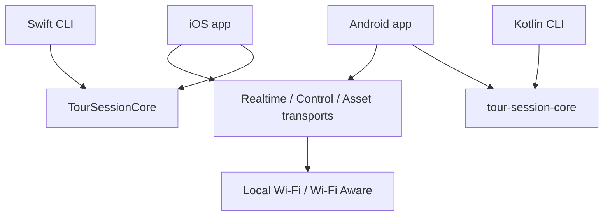

# GetOverHere Tour Guide Product Specification

**Status:** Authoritative implementation target
**Date:** 2026-08-21

## Objective

One guide speaks to a local group of iOS and Android guests without Internet access. During the same live session the guide can present slides, drop a geographic target pin, or point along a compass bearing. Guests hear the guide, receive the current visual state, and recover it after joining late or reconnecting.

## Architecture

| Module | Ownership | Public surface | Dependencies |
|---|---|---|---|
| `TourSessionCore` Swift package | Canonical Swift wire contracts, state rules, fixtures, CLI | GOH2 envelopes, payloads, registries, deterministic encoders | Foundation only |
| `:tour-session-core` Kotlin module | Canonical Kotlin/JVM equivalent | Same GOH2 contracts and behavior | Kotlin/JVM only |
| Swift/Kotlin session CLIs | Host simulation and cross-language proof | Fixture, decode, churn, fault, state, shared-screen, and recovery commands | Respective session core |
| iOS `GetOverHere` app | Apple transports, services, cache, location/heading, SwiftUI | App-internal protocols and user interface | Swift session core; platform frameworks; map renderer |
| Android `:app` | Android transports, services, cache, location/heading, Compose | App-internal interfaces and user interface | Kotlin session core; Android frameworks; map renderer |



The two session cores are equivalent implementations, not dependencies of each other. Exact fixture equality proves their contract.

## Roles and Session Rules

- A session has exactly one guide and zero or more guests.
- Only the guide transmits microphone audio and authoritative presentation, target-pin, pointer, and shared-screen state.
- Guests may send membership, asset readiness, and recovery requests.
- Participant identity is stable across reconnects. A reconnect replaces the older connection rather than incrementing the listener count.
- A late joiner receives the latest complete state snapshot before incremental changes.
- No backend, account, cloud relay, analytics, or Internet connection is required during a tour.

## Realtime Audio

- Guide audio continues while maps or slides are visible.
- Realtime audio has an independent transport lane and cannot wait behind slide or map assets.
- Listener playback defaults to the receiver or connected headset. Speaker mode remains an explicit feedback-prone override.
- Screen locking must not intentionally stop guide capture or guest playback.

## Presentation

- A guide creates or imports an ordered deck from local images.
- Assets are content-addressed, length-checked, and SHA-256 verified.
- Guests fetch only missing assets and report readiness.
- Guide actions are `show`, `hide`, and `go to slide`. Next/previous are guide-side conveniences that produce an authoritative current slide identifier.
- A presented slide opens automatically on guests. A guest may minimize it without changing shared presentation state.
- The guide's selected Slides, Map, or Pointer tool is versioned shared-screen state. Selecting a tool switches guests to that screen even when a slide remains visible.
- A guest may browse another tool locally. The next guide screen selection or presentation action restores the guide's shared screen.
- Reconnect and late join restore the latest visible slide immediately after the required asset is available.

## Geographic Target Map

- The guide opens the offline map and drops, moves, labels, or clears one authoritative target pin.
- Only the target pin is transmitted: target identifier, state version, latitude, longitude, optional label, and visibility.
- Each device obtains its own location locally and renders its own user dot.
- Each guest locally calculates distance and bearing from its location to the target.
- No guide or guest location, path, history, heading, accuracy, or derived movement is transmitted.
- The initial product shows straight-line distance and direction. It does not calculate or share a walking route.
- Map content is local. Missing map content is an explicit setup error; the app does not silently fetch network tiles.

## Sightline Pointer

- The guide can broadcast a compass bearing for targets that do not correspond to a ground coordinate, such as a window or tower detail.
- Guests compare the guide bearing with their own local heading and render an arrow.
- The wire payload contains only the state version, magnetic reference, selected angle, and visibility. Compass accuracy and sample timestamps stay local.
- Pin mode and sightline mode are distinct. Activating one does not fabricate data for the other.
- Invalid or poor sensor accuracy is visible in the interface rather than hidden.

## Offline Tour Pack

A tour pack groups content prepared before the tour:

```text
TourPack
├── metadata and integrity manifest
├── offline map archive and style
├── slide assets and ordering
└── optional saved landmark pins
```

- First implementation choice: MapLibre Native with map data copied into app-owned storage before rendering.
- First archive candidate: local PMTiles plus local style and required sprites/fonts. A two-platform physical spike must prove the exact archive before it becomes the accepted format.
- The guide may import a pack from Files. Guests may already have it or obtain it over the independent asset transport.
- Assets persist across reconnects and may be reused when their hashes match.

## Privacy and Security Invariants

- **The pin is the only geographic coordinate sent by the product.**
- Wire contracts must contain no participant-location or location-history payload.
- Location permission descriptions state that location is used only on-device to show the user relative to the shared pin.
- Session discovery is not authentication. Production onboarding requires possession of a per-tour credential delivered by QR or short code.
- Per-tour credentials and derived keys are not stored in `UserDefaults` or plain preferences.
- Logs contain no credentials, participant locations, slide contents, or persistent personal identifiers.

## Transport Classes

| Class | Examples | Delivery behavior |
|---|---|---|
| Realtime | audio frames | Low latency; late data may be discarded |
| Reliable control | membership, snapshots, shared screen, pin, bearing, presentation, readiness | Ordered, authenticated, reconnectable |
| Reliable asset | slide images, map archives, styles | Chunked, resumable, integrity verified, throttled |

## Product Interface

### Guide

- Create/end tour and see validated listener count.
- Live microphone state remains visible.
- Open Slides to import, reorder, present, hide, or remove images.
- Open Map to drop, move, label, or clear the target pin.
- Open Pointer to capture or update a sightline bearing.
- See tour-pack transfer and guest-readiness state without transport diagnostics.

### Guest

- Join/leave and choose receiver/headset or speaker playback.
- View or minimize the current slide.
- View the offline map with local user dot, shared pin, label, distance, and local arrow.
- View a sightline pointer when active.
- See explicit states for missing pack, unavailable location, poor compass accuracy, and reconnecting.

## Defaults for Open Product Questions

These defaults are active and do not block implementation:

- **Q1 — Map preparation:** Tour operators prepare or import the offline map pack before the tour.
- **Q2 — Slide presentation:** A guide presentation opens automatically; guests may minimize it locally.
- **Q3 — Pin labels:** Labels are optional, guide-authored, and visible to all guests.
- **Q4 — Direction:** Straight-line distance and arrow only; no turn-by-turn navigation.
- **Q5 — Tour-pack delivery:** Preinstalled/cached content is preferred; local guide-to-guest transfer is supported when needed.
- **Q6 — Simultaneous visuals:** The guide-selected Slides, Map, or Pointer screen is authoritative. Existing slide, pin, and bearing state remains current while another screen is shown.

## Explicitly Out of Scope

- Cloud accounts, server storage, cellular dependency, analytics, and remote administration.
- Sharing participant locations, showing other participants on the map, or recording travel history.
- Application-level mesh routing through guest phones.
- Turn-by-turn pedestrian navigation in the initial product.
- Multiple simultaneous guides or guest microphone access.

## Verification Gates

1. Swift and Kotlin emit identical bytes for every GOH2 payload and reject the same invalid boundaries.
2. Host CLIs simulate late join, reconnect, duplicate delivery, reordered delivery, missing assets, and target-state replacement.
3. iOS Simulator and Android JVM/device tests prove state, cache integrity, and local TCP behavior without radio assumptions.
4. Physical iPhone and Android tests prove both guide directions while audio, slide changes, target changes, and asset transfers run together.
5. Lock/background, leave/rejoin, channel restart, malformed asset, missing map, denied location, and poor heading accuracy are exercised.
6. Source and wire audits find no participant-location payload or transmission path.
7. Completion requires every requirement above to have direct code and runtime evidence recorded in `ExperimentLog.md`.
