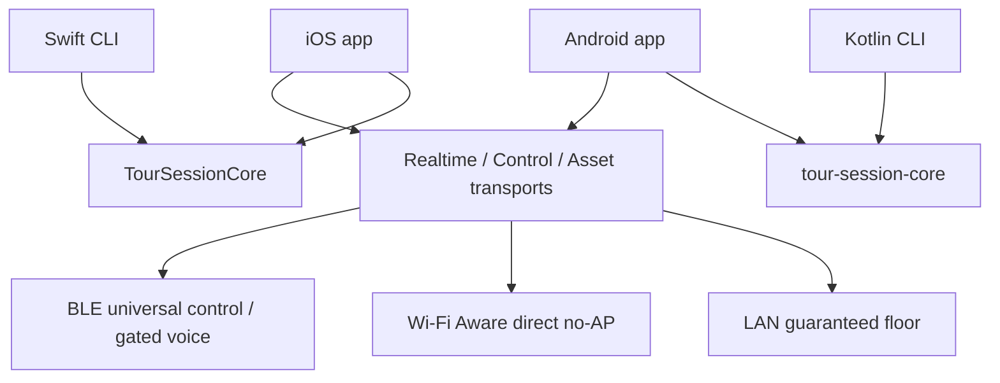

# GetOverHere Tour Guide Product Specification

**Status:** Authoritative implementation target
**Date:** 2026-08-22

**Implementation checkpoint (2026-09-08, in progress):** Direct Bluetooth admission/audio/control/assets and native Aware ownership remain experimental. Admission-bound guide-key pinning and sign-once native lanes are implemented (ADR-059); open-room first contact does not prove human identity. Typed native routes and shared software capacity accounting are implemented, with integration gates recorded in `NextSession.md`. A public Android system-paired subscriber candidate is separate from Android compatibility PIN/NDP; mixed-platform Aware is not complete. Signed native relaying, 30-listener radio capacity and locked-device field requirements remain targets, not delivered claims. The user is away from hardware; current execution is host/simulator/emulator only. One consolidated field checklist is in `FieldAcceptance.md`.

## Objective

The target is one walking guide and 30 mixed iOS/Android audio-ready listeners without Internet or an external router. Wi-Fi and Bluetooth radios may remain enabled; first-use system pairing is allowed and distinct from the optional room code. Preserve the tested local-LAN implementation as a fallback. Router-free operation uses qualified Wi-Fi Aware and BLE routes; Wi-Fi-disabled BLE capacity has its own qualification. During the same live session the guide can present slides, drop a geographic target pin, or point along a compass bearing. Guests hear the guide, receive the current visual state, and recover it after joining late or reconnecting. Discovery, connected sockets or control-only listeners do not satisfy the audio-ready group target.

## Architecture

| Module | Ownership | Public surface | Dependencies |
|---|---|---|---|
| `TourSessionCore` Swift package | Canonical Swift wire contracts, state rules, fixtures, CLI | GOH2/GOS1 envelopes, admission, payloads, registries, deterministic encoders | Foundation, CryptoKit and CommonCrypto |
| `:tour-session-core` Kotlin module | Canonical Kotlin/JVM equivalent | Same GOH2/GOS1 contracts and behavior | Kotlin/JVM and Java cryptography providers |
| Swift/Kotlin session CLIs | Host simulation and cross-language proof | Fixture, decode, churn, fault, state, shared-screen, and recovery commands | Respective session core |
| iOS `GetOverHere` app | Apple transports, services, cache, location/heading, SwiftUI | App-internal protocols and user interface | Swift session core; platform frameworks; map renderer |
| Android `:app` | Android transports, services, cache, location/heading, Compose | App-internal interfaces and user interface | Kotlin session core; Android frameworks; map renderer |



The two session cores are equivalent implementations, not dependencies of each other. Exact fixture equality proves their contract.

## Roles and Session Rules

- A session has exactly one guide and zero or more guests.
- Only the guide transmits microphone audio and authoritative presentation, target-pin, pointer, and shared-screen state.
- Guests may send membership, asset readiness, and recovery requests.
- Participant identity is stable across reconnects. A reconnect replaces the older connection rather than incrementing the listener count.
- A late joiner receives the latest complete state snapshot before incremental changes.
- No backend, account, cloud relay, analytics, or Internet connection is required during a tour.

## Realtime Audio

- Guide audio continues while maps or slides are visible.
- Realtime audio has an independent transport lane and cannot wait behind slide or map assets.
- Realtime frames are compressed, sequenced, authenticated, encrypted, expiry-bounded, and safe to discard when late.
- The local-LAN route is the guaranteed full-quality audio floor. Wi-Fi Aware is the preferred direct no-AP route. A bounded BLE relay path may provide degraded live audio only after its physical acceptance gate passes.
- Listener playback defaults to the receiver or connected headset. Speaker mode remains an explicit feedback-prone override.
- Screen locking must not intentionally stop guide capture or guest playback.

## Presentation

- A guide creates or imports an ordered deck from local images.
- Assets are content-addressed, length-checked, and SHA-256 verified.
- Guests fetch only missing assets and report readiness.
- Guide actions are `show`, `hide`, and `go to slide`. Next/previous are guide-side conveniences that produce an authoritative current slide identifier.
- A presented slide opens automatically on guests. A guest may minimize it without changing shared presentation state.
- The guide's selected Slides, Map, or Pointer tool is versioned shared-screen state. Selecting a tool switches guests to that screen even when a slide remains visible.
- A guest may browse another tool locally. The next guide screen selection or presentation action restores the guide's shared screen.
- Reconnect and late join restore the latest visible slide immediately after the required asset is available.

## Geographic Target Map

- The guide opens the offline map and drops, moves, labels, or clears one authoritative target pin.
- Only the target pin is transmitted: target identifier, state version, latitude, longitude, optional label, and visibility.
- Each device obtains its own location locally and renders its own user dot.
- Each guest locally calculates distance and bearing from its location to the target.
- No guide or guest location, path, history, heading, accuracy, or derived movement is transmitted.
- The initial product shows straight-line distance and direction. It does not calculate or share a walking route.
- Map content is local. Missing map content is an explicit setup error; the app does not silently fetch network tiles.

## Sightline Pointer

- The guide can broadcast a compass bearing for targets that do not correspond to a ground coordinate, such as a window or tower detail.
- Guests compare the guide bearing with their own local heading and render an arrow.
- The wire payload contains only the state version, magnetic reference, selected angle, and visibility. Compass accuracy and sample timestamps stay local.
- Pin mode and sightline mode are distinct. Activating one does not fabricate data for the other.
- Invalid or poor sensor accuracy is visible in the interface rather than hidden.

## Offline Tour Pack

A tour pack groups content prepared before the tour:

```text
TourPack
├── metadata and integrity manifest
├── offline map archive and style
├── slide assets and ordering
└── optional saved landmark pins
```

- First implementation choice: MapLibre Native with map data copied into app-owned storage before rendering.
- First archive candidate: local PMTiles plus local style and required sprites/fonts. A two-platform physical spike must prove the exact archive before it becomes the accepted format.
- The guide may import a pack from Files. Guests may already have it or obtain it over the independent asset transport.
- Assets persist across reconnects and may be reused when their hashes match.

## Privacy and Security Invariants

- **The pin is the only geographic coordinate sent by the product.**
- Wire contracts must contain no participant-location or location-history payload.
- Location permission descriptions state that location is used only on-device to show the user relative to the shared pin.
- Discovery is not authentication. Rooms start open: anyone nearby may request admission. The guide can enable `Lock Room with Code` and edit the code. Admission establishes a separate hidden per-tour media credential; QR scanning and manual code entry are not required for open rooms (ADR-052).
- A room code is an access restriction, not verified guide identity. A malicious guide can solicit a locked-room proof and test code guesses offline; stretching raises the cost but does not prevent this. Short codes must not be described as strong protection against an active impersonator. Previously admitted guests retain access after a code change.
- Admission authentication is not payload confidentiality. Realtime, control, and asset payloads require route-independent authenticated encryption derived from the per-tour credential.
- A logical application frame is encrypted once at creation and remains byte-identical across every route. Transport writers cannot reseal it or allocate a new nonce.
- Legacy plaintext protocol majors are rejected with an explicit version-mismatch state. There is no plaintext downgrade.
- Per-tour credentials and derived keys are not stored in `UserDefaults` or plain preferences.
- Logs contain no credentials, participant locations, slide contents, or persistent personal identifiers.
- There is no individual mid-tour credential revocation. Ending and restarting the tour rotates the hidden media credential and derived keys for the whole session; editing the visible lock code changes future admission only.

## Transport Classes

| Class | Examples | Delivery behavior |
|---|---|---|
| Realtime | audio frames | Low latency; late data may be discarded |
| Reliable control | membership, snapshots, shared screen, pin, bearing, presentation, readiness | Ordered, authenticated, reconnectable |
| Reliable asset | slide images, map archives, styles | Chunked, resumable, integrity verified, throttled |

## Transport Selection

- Native cross-platform Wi-Fi Aware is the preferred transport for realtime, control, and assets when both devices support and establish it.
- The existing local-LAN transport remains the guaranteed full-capability floor when devices share a usable LAN. It is maintained and tested as a first-class route.
- BLE is the universal discovery and bootstrap path and is expected to serve many AP-less guests that do not meet the Aware OS/hardware floor. Its controlled relay overlay carries current authenticated control state and membership; compressed live voice is allowed only if the dedicated physical gate passes.
- Route selection is per participant. A tour may contain Aware, LAN, and BLE guests simultaneously.
- Aware admission stops at the guide device's reported current resource limit. An overflow guest tries LAN, then validated BLE voice, then explicit control-only mode with audio unavailable. Existing Aware guests are not evicted.
- Control-only fallback is a visible degraded state, not completion of the audio-ready group requirement or evidence for a supported listener count.
- Stable session, participant, stream, and sequence identifiers suppress duplicates across overlapping transports and reconnects.
- Android LocalOnlyHotspot/Wi-Fi Direct, portable routers, and bridges between Apple peer-to-peer Wi-Fi and Android Wi-Fi Direct are not production dependencies.
- BLE asset transfer is subordinate to live audio. Full slides and PMTiles prefer Aware/LAN or content prepared before the tour.

## Product Interface

### Guide

- Create/end tour and see separate validated connected and audio-ready counts when a participant is degraded.
- Live microphone state remains visible.
- Open Slides to import, reorder, present, hide, or remove images.
- Open Map to drop, move, label, or clear the target pin.
- Open Pointer to capture or update a sightline bearing.
- See tour-pack transfer and guest-readiness state without transport diagnostics.

### Guest

- Join/leave and choose receiver/headset or speaker playback.
- View or minimize the current slide.
- View the offline map with local user dot, shared pin, label, distance, and local arrow.
- View a sightline pointer when active.
- See explicit states for missing pack, unavailable location, poor compass accuracy, and reconnecting.
- See an explicit control-only/audio-unavailable state when no validated audio route exists.

## Defaults for Open Product Questions

These defaults are active and do not block implementation:

- **Q1 — Map preparation:** Tour operators prepare or import the offline map pack before the tour.
- **Q2 — Slide presentation:** A guide presentation opens automatically; guests may minimize it locally.
- **Q3 — Pin labels:** Labels are optional, guide-authored, and visible to all guests.
- **Q4 — Direction:** Straight-line distance and arrow only; no turn-by-turn navigation.
- **Q5 — Tour-pack delivery:** Preinstalled/cached content is preferred; local guide-to-guest transfer is supported when needed.
- **Q6 — Simultaneous visuals:** The guide-selected Slides, Map, or Pointer screen is authoritative. Existing slide, pin, and bearing state remains current while another screen is shown.

## Explicitly Out of Scope

- Cloud accounts, server storage, cellular dependency, analytics, and remote administration.
- Sharing participant locations, showing other participants on the map, or recording travel history.
- General-purpose, unbounded, or store-and-forward mesh routing. The only guest relay in scope is the bounded current-session BLE control/voice overlay defined by ADR-029.
- Android-hosted Wi-Fi, portable-router setup, or bridging incompatible platform-specific peer-to-peer Wi-Fi networks.
- Turn-by-turn pedestrian navigation in the initial product.
- Multiple simultaneous guides or guest microphone access.

## Verification Gates

1. Swift and Kotlin emit identical bytes for every GOH2 payload and reject the same invalid boundaries.
2. Host CLIs simulate late join, reconnect, duplicate delivery, reordered delivery, missing assets, and target-state replacement.
3. Host CLIs simulate bounded BLE line, star, overlapping-star, partition, relay/successor loss, duplicate-flood, stale-audio, and route-switch behavior at 1/5/10/20/50 logical nodes.
4. iOS Simulator and Android JVM/device tests prove state, cache integrity, encryption/replay boundaries, and local transport behavior without radio assumptions.
5. The isolated physical Wi-Fi Aware lab proves discovery, pairing, NDP establishment, socket traffic, disconnect, and reconnect in both iOS/Android role directions before production promotion.
6. Physical iPhone and Android tests prove both guide directions while compressed audio, slide changes, target changes, and asset transfers run together across each supported route.
7. BLE physical gates progress through 2/5/10 mixed iOS/Android devices and record direct and relayed control/voice latency, loss, queue depth, battery, thermal state, and locked/pocketed behavior. BLE voice is removed if its gate fails.
8. A mixed AP-less field case includes iOS 17–current and Android guests with at least half the phones locked and carried in pockets. Fresh discovery while locked and continued delivery after joining then locking are separate acceptance cases. Bluetooth background modes are declared on iOS and active-session radio ownership is retained, but neither case is physically qualified. Wi-Fi-radio-off BLE tests are separate from no-access-point Aware tests.
9. Aware tests exercise capacity-minus-one, capacity, and capacity-plus-one. Overflow follows ADR-031 and never changes the existing Aware participant set.
10. One guide runs Aware, BLE central, BLE peripheral, LAN, audio encode, and active traffic concurrently for 60 minutes while coexistence loss, thermal state, and battery delta are recorded.
11. Lock/background, leave/rejoin, channel restart, malformed asset, missing map, denied location, poor heading accuracy, and mixed transport availability are exercised.
12. Source and wire audits find no participant-location payload or transmission path and no plaintext application payload path.
13. Exact fixtures prove that one logical frame has byte-identical ciphertext on every route, identity reuse with different plaintext fails, and a legacy major becomes a user-visible version mismatch.
14. Completion requires every requirement above to have direct code and runtime evidence recorded in `ExperimentLog.md`. Supported capacity equals the largest passing physical gate.
